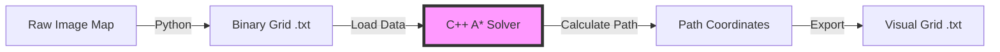
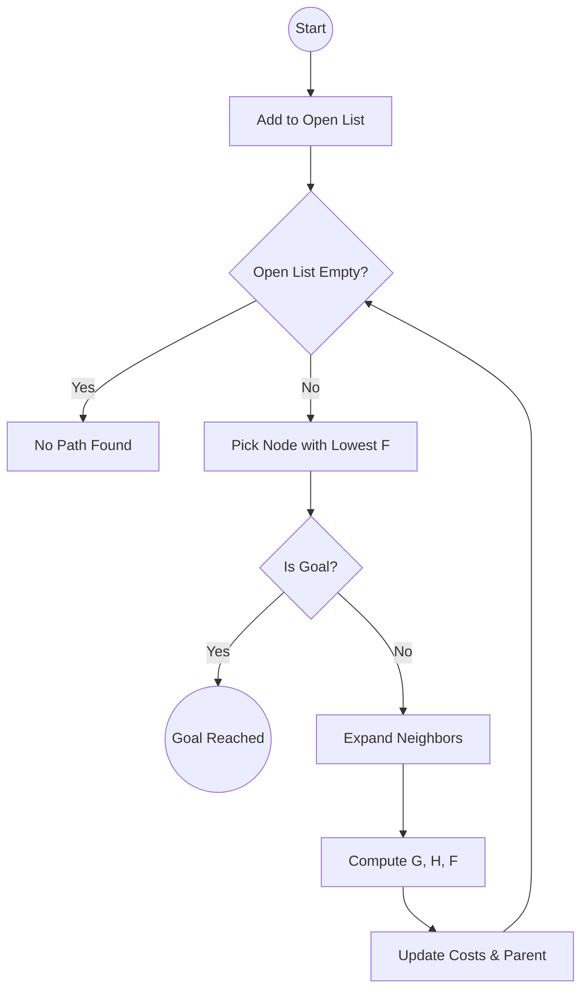

# 🌟 A* Metric Pathfinder (C++ & Python Stack)

> A high-performance autonomous navigation stack that reads a binary map, calculates the optimal path using the A* algorithm, and visualizes the result — while accounting for robot physical dimensions.


---

## 🗺️ How It Works (Pipeline)

This project simulates a complete robotics navigation stack divided into **Perception**, **Planning**, and **Visualization** layers.



### Layer Breakdown
* **Perception (Python):** Reads a pixel-based map (`warehouse.png`) and converts it into a 0/1 binary grid.
* **Planning (C++):** Core A* implementation. Loads the grid, performs path planning, and applies collision physics.
* **Visualization:** Exports a human-readable ASCII grid showing the final safe path.

---

## 🧠 A* Algorithm — Explained Simply

A* (A-Star) is an informed search algorithm that balances past cost and future estimation.

### The Core Formula

$$F = G + H$$

| Variable | Meaning | Intuition |
| :---: | :--- | :--- |
| **G** | Cost from start | Distance already traveled |
| **H** | Heuristic estimate | Straight-line distance to goal |
| **F** | Final score | Estimated total trip cost |

### 🔁 Decision Loop
The planner runs this loop repeatedly until the goal is reached or no path exists.



---

## 🤖 Fat Robot Collision Physics

Most A* tutorials assume the robot is a single pixel. **This system models a physical robot with width.**

### Convolutional Collision Check
Before stepping into a cell, the robot checks a 3×3 neighborhood to ensure clearance.

```text
 X  X  X    ← Top Clearance
 X  C  X    ← Center (Robot)
 X  X  X    ← Bottom Clearance
```

* **C** = Target position
* **X** = Collision scan area

✅ **Move is allowed** only if all `X` cells are free.
❌ **If any `X` cell is an obstacle**, the move is rejected.

*This enforces safe wall clearance automatically.*

---

## 🚀 How to Run

### Prerequisites
* **C++ Compiler:** `g++`
* **Python:** `python3`

### One-Click Launch (Recommended)
```bash
# Make script executable (only once)
chmod +x run_stack.sh

# Launch full stack
./run_stack.sh
```

### Manual Execution
```bash
# 1. Perception Layer
python3 process_map.py

# 2. Compile Planner
g++ -Wall -Wextra main.cpp -o main

# 3. Run Planner
./main
```

---

## 📂 Project Structure

```text
├── main.cpp          # C++ A* planner (core logic)
├── process_map.py    # Image → binary grid converter
├── run_stack.sh      # End-to-end automation
├── binary_grid.txt   # Intermediate map data
└── visual_grid.txt   # Final ASCII path output
```
